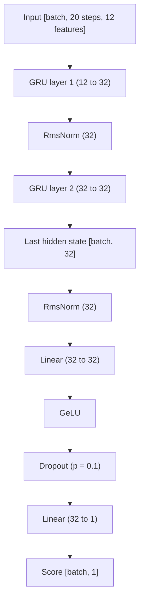
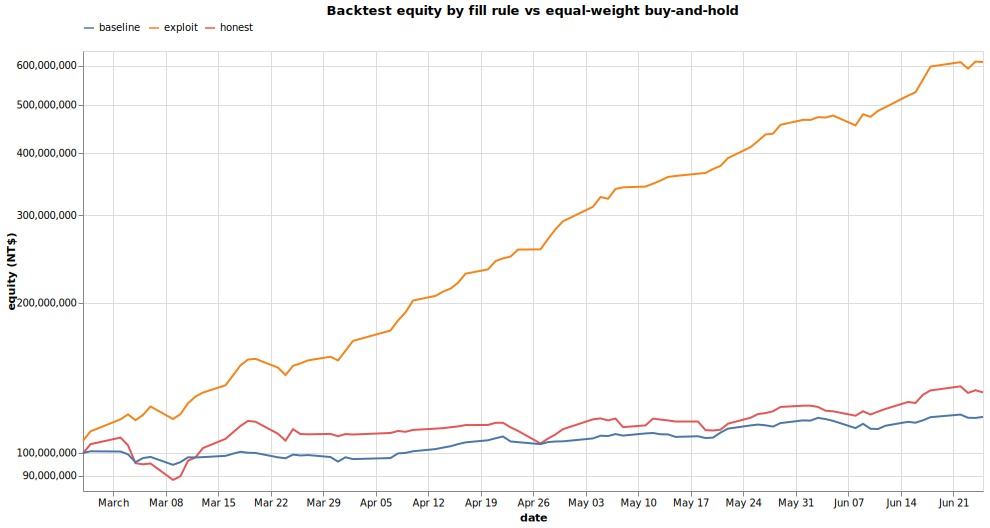

# Burn the stock

[][repo]

An automated trading bot for the Taiwan stock market, built in [Rust][rust] on a [Burn][burn] neural network. I train it on 10 years of daily OHLCV history, then each trading day it reads the past 20 days and ranks the stocks worth buying. The target platform is [sim stock][sim-stock], which I call sim stock throughout this report.

## Goal

Starting from NT$100,000,000 in virtual capital, the bot trades Taiwan listed stocks to maximize total asset value. Profit is the total asset value after market close on 2026-06-26 minus the starting capital, measured over the evaluation window from 2026-02-24 to 2026-06-26. The platform also requires at least 100 executed trades over the period, and this bot clears that bar.

The course specifies six daily fields per ticker (price change percentage, open, close, high, low, and volume), which map onto standard OHLCV bars.

## Project

The project is written in Rust and contains several library crates and two main binaries.

`trainer` handles training and backtesting. It produces the run artifacts and model weights, which I then backtest to evaluate the results.

`trader` holds the HTTP requests to several endpoints, the inference logic, and the order placement. I run it every business day before 1pm, and over the trading period it placed more than 100 live orders on sim stock, clearing the minimum-trade requirement. It fails fairly often because of the Fugle API free tier and a flaky sim stock server, and there is little I can do about either.

Both binaries provide a CLI, with default values set to my best setup.

The binaries also have broad hardware support. If your computer can open a browser to watch videos, it can use your GPU, which covers almost every machine. This all comes from the [Burn][burn] framework and the [WebGPU][webgpu] standard.

## Dataset

The dataset comes from Yahoo Finance's private RESTful API, the same source as the Python library [`yfinance`][yfinance].

I fetch OHLCV and adjusted close from the endpoints, covering around 2000 tickers listed on [sim stock][sim-stock]. The data includes [TWSE/TSE][twse] and [TPEX/OTC][tpex] but intentionally excludes [ESB][esb], since Yahoo Finance does not provide an ESB dataset.

I use the adjusted close to correct the OHLC data for corporate actions such as splits and dividends.

The training set runs from January 2016 to May 2025, and the validation set runs from June 2025 to May 2026.

## Feature Engineering

Raw OHLC values are unbounded and drift over time, so a neural network trained on them struggles to generalize to future data. The fix is to make the features stationary, meaning their distribution stays relatively stable across time.

The transform produces 12 features in two groups of 6.

1. Absolute signals (6 features)

   The open, high, low, close, and volume channels become log ratios against the previous close, plus a range signal that is the log of the same-day high over low. This half keeps the magnitude of each move, the anchor for where the price sits now.

2. Cross-sectional signals (6 features)

   Each absolute signal is z-scored across every ticker on the same day. This half drops the market-wide move and keeps only the relative rank, which guards against overfitting to a single stretch of market regime.

I did not one-hot encode the market type or industry label, because experiments showed they barely moved the output.

## Labeling

The label is a forward maximum favorable excursion (MFE). For each day the entry is the next day's low, and the target is the best peak high over the following 25 trading days, computed as `peak / entry - 1`. This mirrors sim stock's buy-low/sell-high fills.

I then z-score this raw MFE across every ticker on the same date, so the label becomes a per-day rank rather than an absolute move. After z-scoring it is a floating-point score centered at zero with unit standard deviation each day, so values typically fall within about ±3.

See [Fail ideas](#fail-ideas) for why the other labelings did not work.

## Modeling

Stock market data is a time series, so to capture the temporal pattern a GRU module encodes the feature window, and an MLP head turns it into a single score.



The final setup is a 2-layer GRU with a hidden size of 32 and a 20-day input window.

A CNN or a Transformer with positional encoding could learn temporal data too, but I believe a recurrent network suits the job better, and GRU is a proven replacement for LSTM.

The head uses GeLU for its activation, while the GRU itself stays with the original implementation and uses Sigmoid and Tanh as its gate activations.

RmsNorm and a Dropout layer with probability 0.1 guard against overfitting.

The model has a total of 11,905 parameters in this setup.

## Training

The dataset is around 3M rows, and running every row each epoch would take far too long. So I define an epoch as a fixed number of steps, 64 of them, and each step trains on a batch of 4096.

The training loop validates after every epoch and stops early once the validation loss fails to improve for 5 epochs.

Huber loss drives the score regression. It behaves like MSE loss but turns linear once the residual exceeds delta, which is 1.0 here.

On an Intel Core Ultra 9 185H with the [`wgpu`][wgpu] backend, training finishes in about 15 minutes.

```shell
======================== Learner Summary ========================
Model:
"StockRegressor" {
  model: "StockModel" {
    gru_1: Gru {d_input: 12, d_hidden: 32, bias: true, reset_after: true, params: 4416}
    gru_1_norm: RmsNorm {d_model: 32, epsilon: 0.00001, params: 32}
    gru_2: Gru {d_input: 32, d_hidden: 32, bias: true, reset_after: true, params: 6336}
    gru_2_norm: RmsNorm {d_model: 32, epsilon: 0.00001, params: 32}
    hidden: Linear {d_input: 32, d_output: 32, bias: true, params: 1056}
    head: Linear {d_input: 32, d_output: 1, bias: true, params: 33}
    activation: Gelu { approximate: false }
    dropout: Dropout { prob: 0.1 }
    params: 11905
  }
  loss: HuberLoss { delta: 1.0, lin_bias: 0.5 }
  params: 11905
}
Total Epochs: 21


| Split | Metric      | Min.     | Epoch    | Max.     | Epoch    |
|-------|-------------|----------|----------|----------|----------|
| Train | Correlation | 0.279    | 1        | 0.337    | 15       |
| Train | Loss        | 0.232    | 20       | 0.241    | 1        |
| Valid | Correlation | 0.362    | 1        | 0.382    | 16       |
| Valid | Loss        | 0.228    | 16       | 0.232    | 1        |
```

## Portfolio

Using the past 20 days of data across all TSE and OTC tickers, the model outputs a predicted score that clusters near zero. I take the top 100 and keep the positive ones as the buy candidates.

I then fetch a real-time quote from the [Fugle Quote API](https://developer.fugle.tw/docs/data/http-api/intraday/quote) to read the low and high price at that moment. These are not the day's final low and high after the close, but they give a safe range that always lands a valid order on sim stock.

I sell every stock currently held at the high, then buy the candidates at the low, splitting the remaining cash equally across them.

## Backtest

Sim stock has a severe design flaw. Orders can be placed before 1pm, and any price between the day's low and high is accepted.

So to maximize profit you simply sell every stock you hold at the high and buy at the low, which banks at least `high - low - fee` per trade.

This is not how a real market works. Even a model with little market insight reaches 506% profit over the official evaluation window from 2026-02-24 to 2026-06-26.

```shell
❯ cargo run -r --bin trainer -- backtest --artifact-dir .\artifacts\latest\ --fill low-high --rotate --valid-from 2026-02-24
    Finished `release` profile [optimized] target(s) in 0.60s
     Running `target\release\trainer.exe backtest --artifact-dir .\artifacts\latest\ --fill low-high --rotate --valid-from 2026-02-24`
Backtest summary
  Window
    dates             : 2026-02-25 -> 2026-06-24
    trading days      : 81
    tickers scored    : 2193
    windows scored    : 177868
    buy gate          : score > 0.00
    rotate hurdle     : 0.585% edge gain (one round trip)
    fills             : low/high (optimistic)
    weighting         : equal per slot
  Performance
    starting cash     : NT$100,000,000
    final equity      : NT$606,955,565
    cumulative        : +506.96%
    annualized        : +1577.20%
    sharpe            : 13.93  (daily returns, annualized)
    trades            : 309
    exits             : take-profit 1 / stop-loss 0 / time 0 / signal 0 / rotate 298 / final 10
    win rate          : 79.9%  (trades closed in profit)
    profit factor     : 9.73  (gross profit / gross loss)
    average win / loss: +12.81% / -5.17%  (return on cost)
  Note: annualized is naive linear (x252 per day), unreliable under ~30 trading days

Wrote equity curve to .\artifacts\latest\backtest-equity.csv
Wrote trades to .\artifacts\latest\backtest-trades.csv
Wrote actions to .\artifacts\latest\backtest-actions.csv
```

To test the model more honestly, I restrict the portfolio strategy to buy and sell only at the open price. The profit drops sharply but still reaches +31%.

```shell
❯ cargo run -r --bin trainer -- backtest --artifact-dir .\artifacts\latest\ --valid-from 2026-02-24
    Finished `release` profile [optimized] target(s) in 0.65s
     Running `target\release\trainer.exe backtest --artifact-dir .\artifacts\latest\ --valid-from 2026-02-24`
Backtest summary
  Window
    dates             : 2026-02-25 -> 2026-06-24
    trading days      : 81
    tickers scored    : 2193
    windows scored    : 177868
    buy gate          : score > 0.00
    rotate hurdle     : 0.585% edge gain (one round trip)
    fills             : open (pessimistic)
    weighting         : equal per slot
  Performance
    starting cash     : NT$100,000,000
    final equity      : NT$131,340,988
    cumulative        : +31.34%
    annualized        : +97.51%
    sharpe            : 2.29  (daily returns, annualized)
    trades            : 43
    exits             : take-profit 3 / stop-loss 0 / time 36 / signal 0 / rotate 0 / final 4
    win rate          : 60.5%  (trades closed in profit)
    profit factor     : 2.66  (gross profit / gross loss)
    average win / loss: +32.46% / -14.06%  (return on cost)
  Note: annualized is naive linear (x252 per day), unreliable under ~30 trading days

Wrote equity curve to .\artifacts\latest\backtest-equity.csv
Wrote trades to .\artifacts\latest\backtest-trades.csv
Wrote actions to .\artifacts\latest\backtest-actions.csv
```



On a log axis the three curves separate cleanly. The exploit fill (buy at low, sell at high) compounds to about +510%, the honest open fill returns about +32%, and an equal-weight buy-and-hold of every ticker priced on the first day returns +18%. So almost all of the headline return comes from the platform's fill rule, while the model itself adds roughly 14 points over simply holding the market.

The model profits on 60 to 80 percent of trades, with an average win clearly larger than the average loss. Combined with the margin over buy-and-hold, this points to a real if modest selection signal.

To be clear, this is not a real result on sim stock but a custom evaluation. Since sim stock's rules are simple and easy to reimplement, it should mirror the platform closely.

## Fail ideas

### Oracle labeling

In the first attempt I figured a classification model would be easier to train than the regression I use now, so I labeled each row with Sell, Buy, or Hold. Buy if the next extreme price is up, sell if it is down, and hold if the move stays within the transaction fee. This is undoubtedly the optimal strategy to act on, since it uses future data to decide what I should have done in the past, the simple idea being buy low and sell high.

But the model never converged, with nothing to learn. My conclusion is that, with OHLCV data alone, whether a ticker rises or drops in the far future is pure noise.

### Triple barrier labeling

I read the paper [Stock Price Prediction Using Triple Barrier Labeling and Raw OHLCV Data: Evidence from Korean Markets](https://arxiv.org/html/2504.02249v1) and tried to replicate the result.

Triple barrier labeling identifies which barrier a ticker hits first. Buy if it rises by N% within a fixed D days, sell if it drops by M% within D days first, otherwise hold. It is not the optimal strategy, but it is a more predictable target, and predicting the near future seems easier than the unbounded far future.

Sadly I could not replicate the paper's result. It claims a macro F1 score of 43%, and I got close at around 42%, but the model could not actually profit in a portfolio strategy. High precision does not guarantee you make more money than you lose.

Although the labeling did not work, I borrowed a lot from the paper's model design. They claim a small recurrent model works particularly well, which is close to my setup, a GRU with a hidden size of 32.

## Conclusion

The model captures a weak but real cross-sectional signal. Over the course evaluation window the honest open-fill strategy returns about +32%, beating an equal-weight buy-and-hold of the market at +18%, and the platform's buy-low/sell-high rule is what turns that edge into the headline +506%.

The validation correlation of 0.36 to 0.38 is a rank correlation, since the label is a per-date z-scored MFE. It measures how well the model orders stocks for the day, not how well it predicts an absolute return.

Limitations. The honest backtest closes only around 49 trades over 82 trading days, so the Sharpe and win rate carry wide error bars and read as directional rather than precise. Most positions exit on the 20-day time stop rather than a model signal, so part of the return comes from holding a diversified book rather than sharp timing. The model trains only on data through mid 2025, so the backtest window is out of sample for the weights, though early stopping selects on a validation window that overlaps the evaluation period, a minor caveat that the fixed course window makes unavoidable.

Future work. The clearest next steps are feature-importance ablations to see which of the 12 signals carry the load, exporting the best-validation checkpoint instead of the final epoch to avoid the overfit tail, and a larger out-of-sample window once more data accrues.

## Feedback

### On sim stock

To be blunt, sim stock is fairly flaky. I assume the backend is a single-threaded, synchronous Python server. I constantly hit 5xx errors, response times are long, and orders are sometimes rejected with reasons like `交易失敗(今日無開盤)`, which is not true.

Beyond that, the optimal strategy is clearly to scan for the tickers that grow the most and go all in at the low. That is an immediate 10% profit whenever at least one ticker in the market hits the ceiling limit, and the ESB market has no such limit at all. This invalidates everyone's effort on designing and training models.

### On the dataset

There is simply no high-quality provider with generous enough rate limits for 10 years of stock market history.

Yahoo Finance is a great source of historical bar data, but it is not a public endpoint. Python's well-known `yfinance` library wraps these endpoints, so I wrote my own Rust implementation of the RESTful API for what I needed. The clear downside is that the data lags, so I cannot use it for real-time quotes.

Among the free-tier APIs ([Fugle][fugle], [FinMind][finmind], [Shioaji][shioaji]), Fugle has the best documentation and a rate limit of 60 per minute, slow but usable for the real-time quotes my trader needs.

The problem is that the course never mentioned any of this, and the trial and error ate up time better spent on the actual neural network work. The TWSE and TPEX endpoints are not truly public, carry irregular data that is hard to parse and validate, and do not even provide historical data. The course should supply this data itself.

[repo]: https://github.com/Stanley5249/burn-the-stock
[sim-stock]: https://ciot.imis.ncku.edu.tw/stock
[twse]: https://www.twse.com.tw/zh/index.html
[tpex]: https://www.tpex.org.tw/zh-tw/index.html
[esb]: https://www.tpex.org.tw/en-us/esb/trading/rules/overview.html
[yfinance]: https://github.com/ranaroussi/yfinance
[rust]: https://www.rust-lang.org
[burn]: https://burn.dev
[webgpu]: https://www.w3.org/TR/webgpu/
[wgpu]: https://wgpu.rs
[fugle]: https://developer.fugle.tw
[finmind]: https://finmind.github.io/
[shioaji]: https://sinotrade.github.io/
